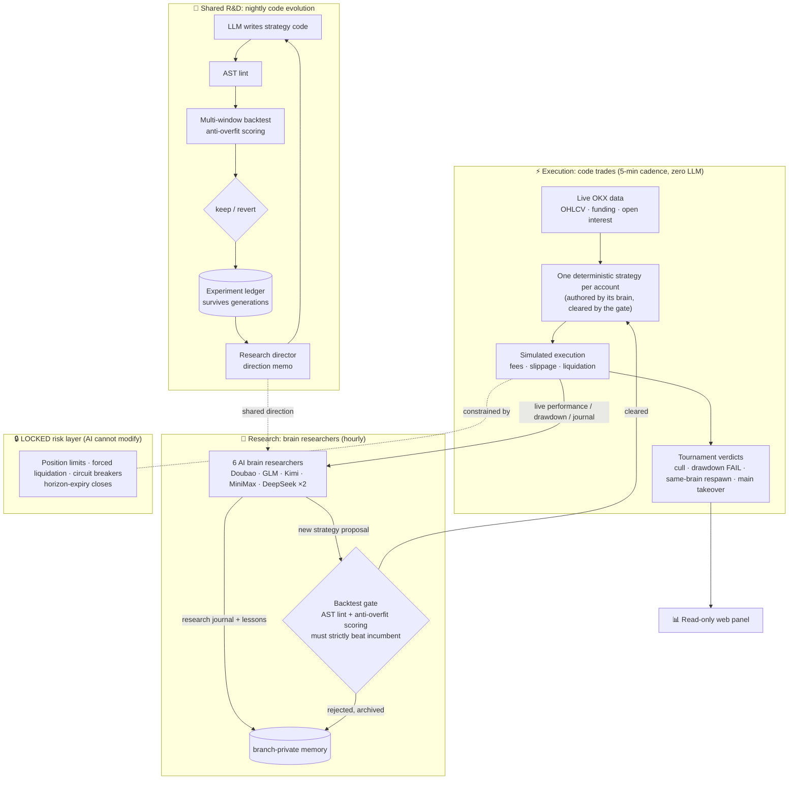

# AlphaLoop-Crypto 🧠⚔️

**Different AI brains trade the same live market. The survivor takes over the main account.**

English | [中文](README.md) | **[🔴 Live panel →](http://45.76.188.163:8080)**

> That link is the ongoing competition: real-time NAV for all 6 brains, positions, and the full reasoning behind every decision, refreshed every minute.

A 24/7 unattended crypto **paper-trading** evolution system (no real money). It doesn't backtest against canned data — it trades on live OKX market data with real funding-rate settlement, pitting multiple LLMs against each other in real time, while a nightly pipeline evolves deterministic strategy code through backtesting.

## The Quant Derby

Current format (Gen 5): **LLMs no longer place orders — each brain is a "quant researcher", and what actually trades is the strategy code it writes.**

- 🤖 **Code trades**: every account is driven by a deterministic strategy, executed every 5 minutes — zero LLM calls, zero cost, millisecond latency
- 🔬 **Hourly research**: 5 LLMs from different vendors (Doubao / GLM / Kimi / MiniMax / DeepSeek) plus a champion baseline each review their own strategy's live performance every hour, keeping a research journal of lessons learned
- 🚪 **Code changes must earn their way in**: a researcher can propose a new strategy version any time, but it must pass AST linting + multi-window anti-overfit backtesting and **strictly outscore the incumbent version** — ties don't ship; a 4-hour proposal cooldown prevents overreacting to noise
- 🌱 **Everyone starts from zero**: all brains begin with the same flat seed strategy; every line of trading code on the field was researched by the brain itself

Survival rules (unchanged across generations):

- 💀 **Liquidation = death.** Drawdown over 15% = elimination
- 🔪 **Bottom-feeder cull**: every 72 hours the lowest earner is out — idling flat at zero return is just as fatal
- ♻️ **Same-brain respawn**: an eliminated brain re-enters with a fresh 100U — **its strategy lineage and death count persist forever**
- 👑 **Winner takes all**: outperform the main account by 0.5pp and that brain's strategy code and research mandate take over the main account

The derby's question has been upgraded accordingly: **which brain is the better quant researcher?**

> The previous generation (Brain Derby: LLMs trading directly every 30 minutes) is fully archived. Its verdict: given identical mandates, models spontaneously diverged into 10x-leverage all-in styles vs. cautious small-size styles — caution won. Its exposed weaknesses (innate LLM long bias, untestable decisions) drove this architecture upgrade.

## Dual-Loop Auto-Evolution

The derby is the front stage. Backstage, an independent code-evolution pipeline runs nightly (autoresearch-style dual loop):

- **Inner loop** (nightly): LLM writes strategy code → AST lint → multi-window backtest with anti-overfit scoring (any validation-window liquidation is an instant veto) → winners join the live forward pool alongside the brains
- **Outer loop** (research director): reads the full experiment ledger and death archives, writes a direction memo steering the next night's experiments — it independently discovers things like "this parameter-tuning lineage has plateaued, switch tracks"

Strategy knowledge survives across generations: trading data can be reset; the experiment ledger is never wiped.

## Architecture



## Results

> 📸 Screenshot slots: drop panel screenshots into `docs/screenshots/` and uncomment below
> (suggested: NAV overview, brain scoreboard with death/promotion counts, positions with reasoning).

<!--


-->

<!-- Per-generation battle reports go here: Gen N · dates · champion brain · key events -->

## Quick Start

```bash
pip install -r requirements.txt
# Edit config.yaml (llm.mode: api requires the corresponding API-key env vars;
# see the llm.api.providers section for multi-brain routing)
python scripts/ignite.py        # Ignition: cold-start research + resident decision loop
python webui/app.py             # Panel: http://127.0.0.1:8080
python -m pytest tests/ -q      # Full test suite (550+)
```

## Repository Map

| Path | What it is |
|---|---|
| `scripts/ignite.py` | Main daemon: decision loop, tournament, brain derby, multi-provider routing |
| `scripts/research_loop.py` | Nightly inner loop + research-director outer loop |
| `LOCKED/` | Deterministic risk control & backtest engine — the AI cannot modify this zone |
| `ASSET/strategy/` | Trader prompts, strategy code pool, dispatcher |
| `ASSET/memory/` | Branch-isolated reflection memory engine |
| `webui/` | Read-only panel (zero-compute principle: display, never infer) |
| `tests/` | 550+ tests, from risk red-lines to brain respawn |

## Disclaimer

- Pure research project. **Paper trading only — no real money involved.**
- Nothing here is investment advice. If you adapt it for live trading, the risk is entirely yours.
- The AIs will lose money. Watching *how* they lose it is, in fact, the point.
