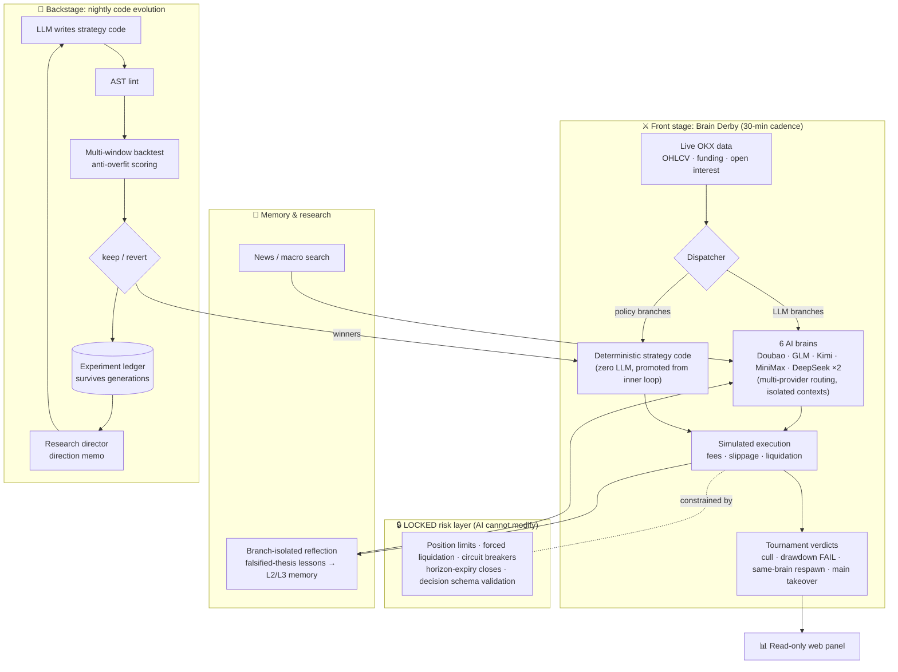

# AlphaLoop-Crypto 🧠⚔️

**Different AI brains trade the same live market. The survivor takes over the main account.**

English | [中文](README.md)

A 24/7 unattended crypto **paper-trading** evolution system (no real money). It doesn't backtest against canned data — it trades on live OKX market data with real funding-rate settlement, pitting multiple LLMs against each other in real time, while a nightly pipeline evolves deterministic strategy code through backtesting.

## The Brain Derby

Current format: 5 LLMs from different vendors (Doubao / GLM / Kimi / MiniMax / DeepSeek) plus one champion baseline, each managing its own simulated account. Every brain receives **the exact same neutral mandate** — no style hints whatsoever. Long or short, leverage, symbol selection: all up to the brain. The only variable is *which model is thinking*.

Survival rules:

- 💀 **Liquidation = death.** Drawdown over 15% = elimination
- 🔪 **Bottom-feeder cull**: every 72 hours, the lowest earner is eliminated — mediocrity is as fatal as losing
- ♻️ **Same-brain respawn**: an eliminated brain re-enters with a fresh 100U, but its death count is permanently public
- 👑 **Winner takes all**: outperform the main account by 0.5pp and that brain takes over the main account's decision-making

Every non-hold decision must state a **falsifiable stop condition** (triggered = force-closed) and a **holding horizon** (expired = force-closed). No vagueness, no overstaying.

Given identical mandates, the brains diverged into completely different personalities within 45 hours — one going all-in at 10x leverage, one staying cautious in small size, one spreading ten small positions. Which is exactly the question this derby exists to answer: **which brain is natively better at trading?**

## Dual-Loop Auto-Evolution

The derby is the front stage. Backstage, an independent code-evolution pipeline runs nightly (autoresearch-style dual loop):

- **Inner loop** (nightly): LLM writes strategy code → AST lint → multi-window backtest with anti-overfit scoring (any validation-window liquidation is an instant veto) → winners join the live forward pool alongside the brains
- **Outer loop** (research director): reads the full experiment ledger and death archives, writes a direction memo steering the next night's experiments — it independently discovers things like "this parameter-tuning lineage has plateaued, switch tracks"

Strategy knowledge survives across generations: trading data can be reset; the experiment ledger is never wiped.

## Architecture



## Results

> 📸 Screenshot slots: drop panel screenshots into `docs/screenshots/` and uncomment below
> (suggested: NAV overview, brain scoreboard with death/promotion counts, positions with reasoning).

<!--


-->

<!-- Per-generation battle reports go here: Gen N · dates · champion brain · key events -->

## Quick Start

```bash
pip install -r requirements.txt
# Edit config.yaml (llm.mode: api requires the corresponding API-key env vars;
# see the llm.api.providers section for multi-brain routing)
python scripts/ignite.py        # Ignition: cold-start research + resident decision loop
python webui/app.py             # Panel: http://127.0.0.1:8080
python -m pytest tests/ -q      # Full test suite (550+)
```

## Repository Map

| Path | What it is |
|---|---|
| `scripts/ignite.py` | Main daemon: decision loop, tournament, brain derby, multi-provider routing |
| `scripts/research_loop.py` | Nightly inner loop + research-director outer loop |
| `LOCKED/` | Deterministic risk control & backtest engine — the AI cannot modify this zone |
| `ASSET/strategy/` | Trader prompts, strategy code pool, dispatcher |
| `ASSET/memory/` | Branch-isolated reflection memory engine |
| `webui/` | Read-only panel (zero-compute principle: display, never infer) |
| `tests/` | 550+ tests, from risk red-lines to brain respawn |

## Disclaimer

- Pure research project. **Paper trading only — no real money involved.**
- Nothing here is investment advice. If you adapt it for live trading, the risk is entirely yours.
- The AIs will lose money. Watching *how* they lose it is, in fact, the point.
