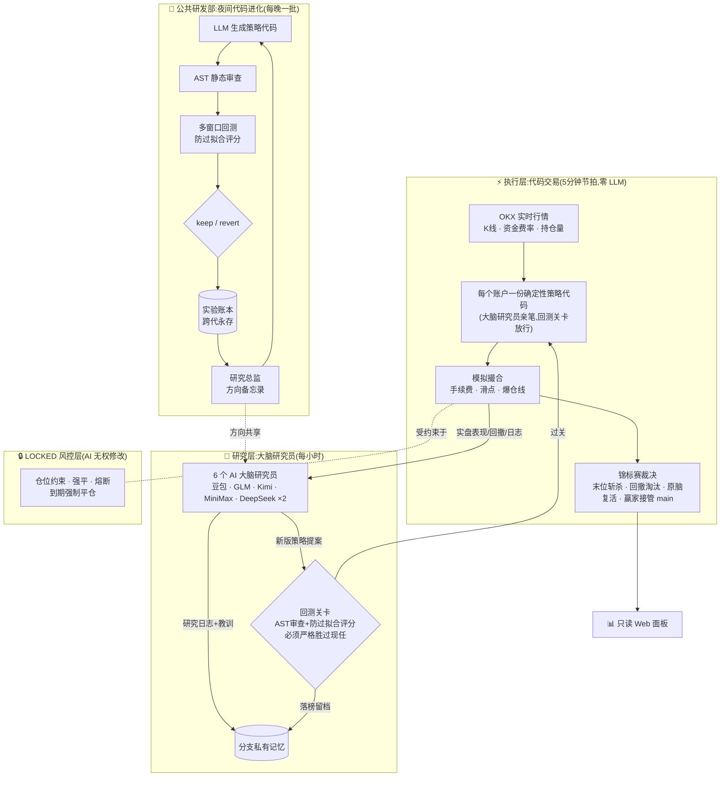

# AlphaLoop-Crypto 🧠⚔️

**让不同的 AI 大脑在真实行情里同台交易,活下来的接管主账户。**

[English](README.en.md) | 中文 | **[🔴 实盘直播面板 →](http://45.76.188.163:8080)**

> 上面的链接就是正在进行的比赛:6 个大脑的实时净值、持仓和每笔决策的完整理由,1 分钟刷新。

这是一个 24 小时无人值守的加密货币**纸面交易**(paper trading,无真实资金)进化系统。它不回测、不模拟行情——用 OKX 的真实实时行情和真实资金费率结算,让多个大模型各管一个模拟账户真刀真枪地对决,同时在夜间用回测流水线自动进化确定性策略代码。

## 量化研究员德比(Quant Derby)

当前赛制(第五代):**大模型不再直接下单——每个大脑是一名"量化研究员",真正交易的是它写的策略代码。**

- 🤖 **代码交易**:每个账户由一份确定性策略代码驱动,每 5 分钟执行一次,零 LLM 调用、零成本、毫秒级
- 🔬 **每小时研究**:5 个不同厂商的大模型(豆包 / GLM / Kimi / MiniMax / DeepSeek)+ 擂主基准,各自每小时审视自己策略的实盘表现,写研究日志、总结教训
- 🚪 **改码必须凭成绩**:研究员随时可以提交新版策略,但必须通过 AST 静态审查 + 多窗口防过拟合回测,**分数严格超过现任版本才能上线**,平手都不换;4 小时提案冷却,防止对噪声过度反应
- 🌱 **人人从零开始**:所有大脑从同一个空仓种子策略起步,场上每一行交易代码都是大脑自己研究出来的

生存规则(与历代一致):

- 💀 **爆仓即死**,净值回撤超 15% 淘汰
- 🔪 **末位斩杀**:每 72 小时,赚得最少的直接出局——空仓摆烂零收益一样是死罪
- ♻️ **原脑复活**:出局后同一个大脑带着新的 100U 重生,**策略血统和死亡计数都永久保留**
- 👑 **赢家通吃**:持续跑赢主账户 0.5 个百分点,该大脑的策略代码与研究权直接接管主账户

这场德比要回答的问题也随之升级:**哪个大脑是更好的量化研究员?**

> 前一代(大脑德比:LLM 直接每 30 分钟读盘下单)的完整战绩与数据已存档。那一代的结论:同一份任务书下,不同模型自发分化出 10 倍杠杆梭哈流与轻仓稳健流,稳健者胜——也正是那一代暴露的"LLM 天生做多偏见、决策不可回测"促成了本次架构升级。

## 双环自动进化

交易德比是前台,后台还有一条独立的代码进化流水线(仿 autoresearch 双环架构):

- **内环**(每晚自动运行):LLM 编写策略代码 → AST 静态审查 → 多窗口历史回测(防过拟合评分,验证集清算一票否决)→ 优胜者进入前向实盘池与大脑们同场竞技
- **外环**(研究总监):通读全部实验账本和死亡档案,产出方向备忘录,指导下一晚的实验方向——它会自己发现"这条路线调参到头了"、"该换赛道了"

策略知识跨代保留:交易数据可以清零重开,实验账本永不清零。

## 架构



## 战绩

> 📸 截图位:把面板截图放进 `docs/screenshots/` 后,取消下面的注释即可显示
> (建议三张:净值曲线总览、大脑记分板含死亡/晋升计数、持仓与决策理由)。

<!--


-->

<!-- 每代战报可以追加在这里:第 N 代 · 起止日期 · 冠军大脑 · 关键事件 -->

## 快速开始

```bash
pip install -r requirements.txt
# 配置 config.yaml(llm.mode: api 需要相应的 API key 环境变量,
# 多大脑路由见 llm.api.providers 段)
python scripts/ignite.py        # 点火:冷启动研究 + 常驻决策循环
python webui/app.py             # 面板:http://127.0.0.1:8080
python -m pytest tests/ -q      # 全套测试(550+)
```

## 目录速览

| 目录 | 内容 |
|---|---|
| `scripts/ignite.py` | 主守护进程:决策循环、锦标赛、大脑德比、多供应商路由 |
| `scripts/research_loop.py` | 夜间代码进化内环 + 研究总监外环 |
| `LOCKED/` | 确定性风控与回测引擎,AI 无权修改的铁律区 |
| `ASSET/strategy/` | 交易员 prompt、策略代码池、分发器 |
| `ASSET/memory/` | 分支隔离的反思记忆引擎 |
| `webui/` | 只读面板(零计算原则:只展示,不推断) |
| `tests/` | 550+ 测试,覆盖风控红线到大脑复活 |

## 声明

- 纯研究项目,**纸面交易,不涉及任何真实资金**
- 不构成任何投资建议;若你把它改造成实盘,风险完全自负
- AI 会亏钱。事实上,看它们怎么亏钱正是这个项目的意义所在
